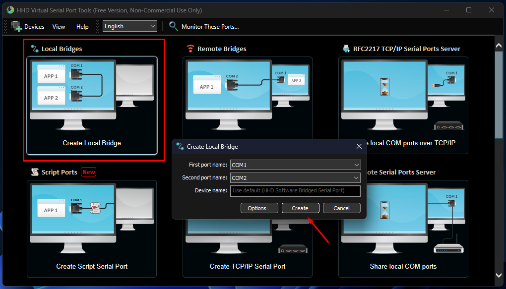
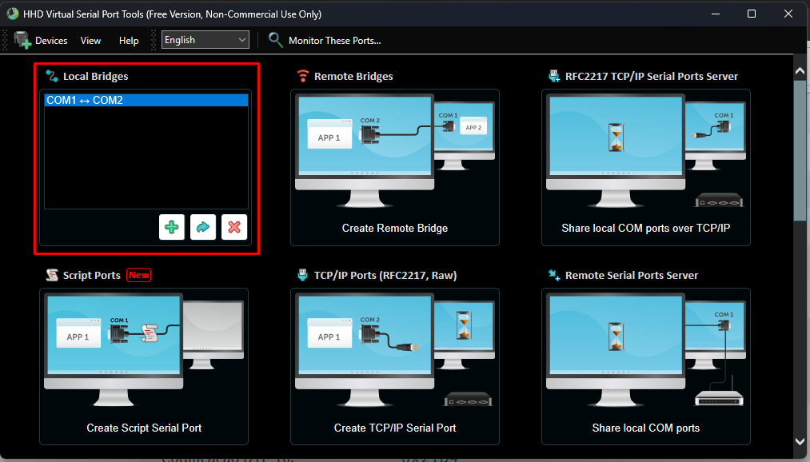
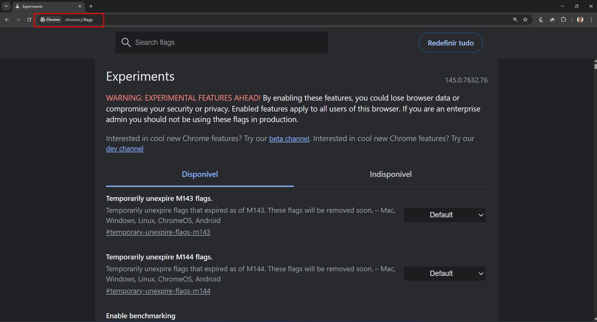
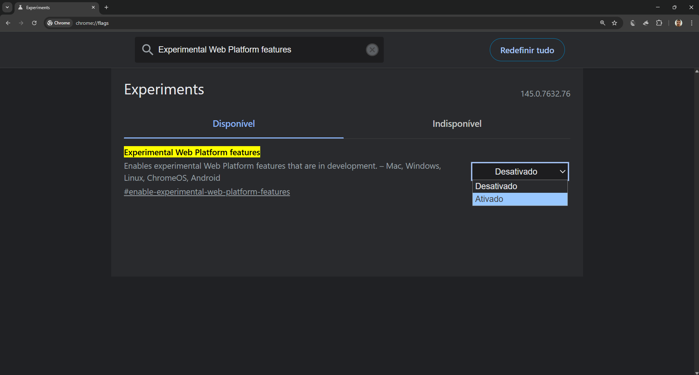
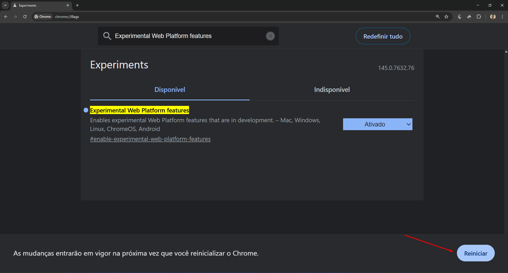
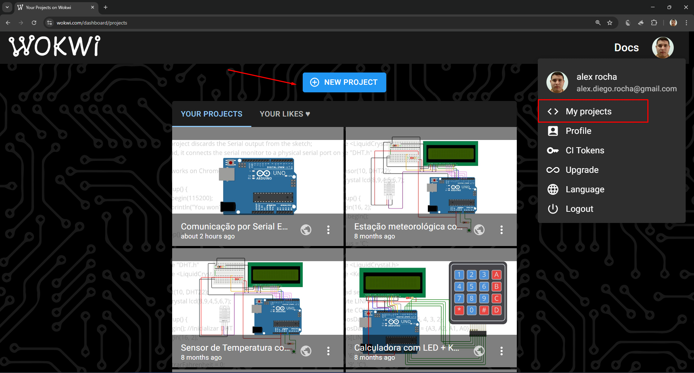
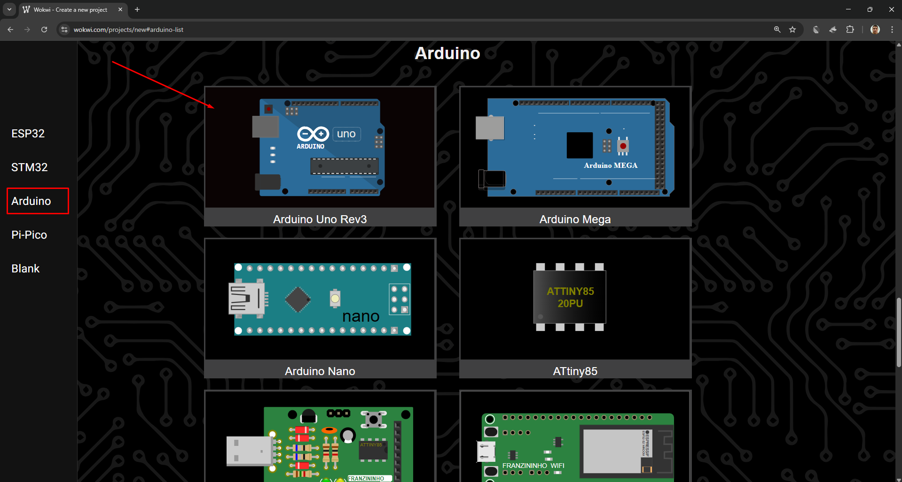
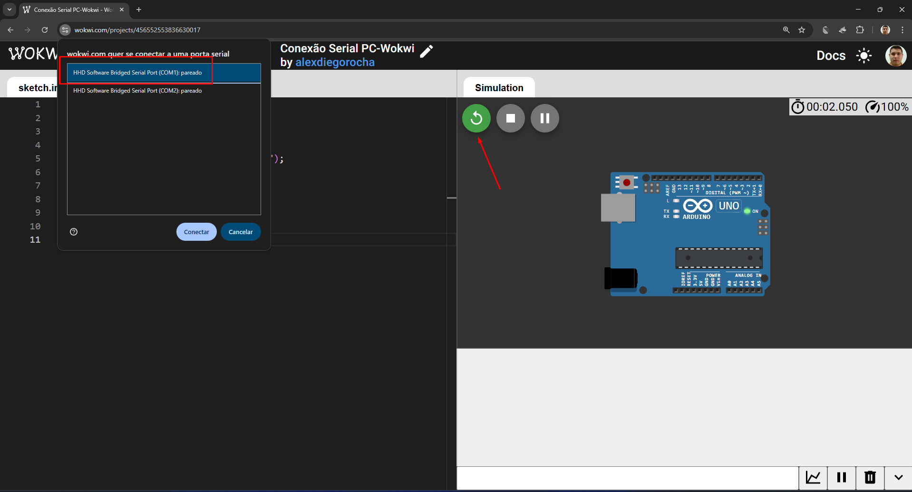
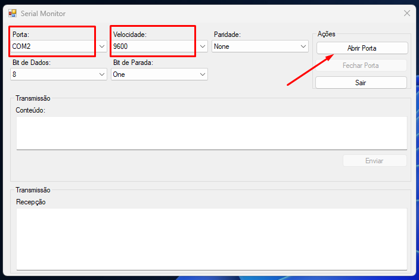

# Configuração do WOKWI para funcionar com Porta Serial (COM)

Neste tutorial, veremos como configurar os projetos no [Wokwi](https://wokwi.com/) para se comunicarem através das portas seriais do computador. 

Para tal, será necessário a utilização de portas seriais físicas ou virtuais, podendo ser a de placas externas ou simuladores de portas de comunicação. Neste tutorial, será utilizado como exemplo o simulador de portas seriais virtuais [Free Virtual USB Tools](https://hhdsoftware.com/), podendo ser utilizado gratuitamente com limitações, e o navegador [Google Chrome](https://www.google.com/intl/pt-BR/chrome/).


## Recursos

- Wokwi: [https://wokwi.com/projects/306534287811805760](https://wokwi.com/projects/306534287811805760)
- Google Chrome: [https://www.google.com/intl/pt-BR/chrome/](https://www.google.com/intl/pt-BR/chrome/)

## Configurando o Free Virtual USB Tools

1. Acesse a interface do Free Virtual USB Tools e CRIE uma conexão por Ponte Local (*Local Bridge*):



2. Após a criação da Ponte entre portas, você verá um item na seção *Local Bridge* indicando que há uma comunicação bidirecional entre as portas (COM1⇔COM2).




## Configurando o Google Chrome 

1. Abra no Google Chrome e acesse a página de configuração de recursos experimentais [chrome://flags/](chrome://flags/):



2. Na barra de pesquisa, busque pela opção ***"Experimental Web Platform features"*** e marque a opção encontrada como **ATIVADO**:



3. Clique no botão **Reiniciar**, presente na parte inferior da tela, para recarregar as configurações do Google Chrome:



## Configurando o projeto no Wokwi

É altamente recomendado que você crie uma conta na plataforma, permitindo que você possa criar projetos em branco, apenas com a placa desejada.


1. Com sua conta autenticada no Wowki, ACESSE a área de projetos e clique no botão [***New Project*** ](https://wokwi.com/dashboard/projects):




2. CRIE um projeto com a placa **Arduino Uno Rev3** ou a que se adequa ao seu projeto:




3. No ***sketch.ino***, INICIE o ***Monitor Serial** com o *baud rate* que será usado para a comunicação (o padrão é 115200):

```cpp
// Funciona somente no Google Chrome

void setup() {
  Serial.begin(9600);
  Serial.println("Iniciando o terminal");
}

void loop() {
  
}
```

4. No arquivo ***diagram.json*** CONFIGURE o acesso serial dentro da seção ***parts***, informe o mesmo baud usado para instanciar o *Serial*.

```cpp
  "parts": [
    {
      "type": "wokwi-arduino-uno",
      "id": "uno",
      "top": 0,
      "left": 0,
      "attrs": {}
    },
    {
      "id": "serial",
      "type": "wokwi-serial-port",
      "attrs": { "baud": "9600" }
    }
  ],
```

5. Configure o mapeamento da comunicação de entrada e saída (TX/RX) serial na seção ***connections***. O mapeamento acontece através dos apelidos ****serial:*** (porta COM física ou virtual) e ***serialMonitor:*** (porta serial da placa no Wokwi):

```cpp
  "connections": [
    ["$serialMonitor:RX", "serial:TX", ""],
    ["$serialMonitor:TX", "serial:RX", ""]
  ]
```

6. Habilite o display do Monitor Serial do Wokwi na seção ***serialMonitor***:

```cpp
  "serialMonitor": {
    "display": "always"
  }
```

7. Inicie a execução do projeto no Wokwi e selecione uma porta serial para conexão:



8. Abra o [Monitor Serial](../cap_7_monitor_serial/), desenvolvido no capítulo 7, e inicie a conexão com a outra porta COM da ponte:



9. TESTE a comunicação entre o ***Wokwi*** e o ***Monitor Serial***:


## Acesso ao projeto

Você pode acessar o projeto do Wokwi para testar clicando neste link: [https://wokwi.com/projects/456552553836630017](https://wokwi.com/projects/456552553836630017).

---

Desenvolvido por [Alex Rocha](https://www.linkedin.com/in/alexdiegorocha/).